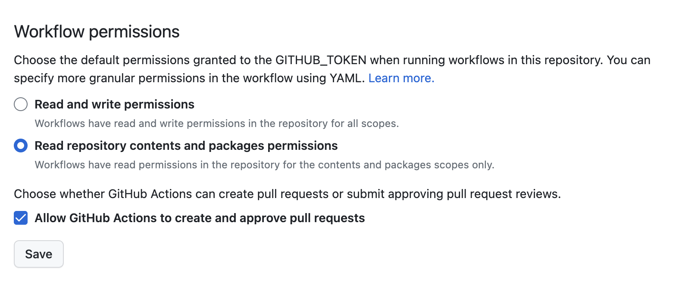

# Open PR to merge Main into Dev

## test

another

## Permissions

## sf

Append `/settings/actions` to the repository URL and under `Workflow permissions` check `Allow GitHub Actions to create and approve pull requests`

## release 1.2.3.
